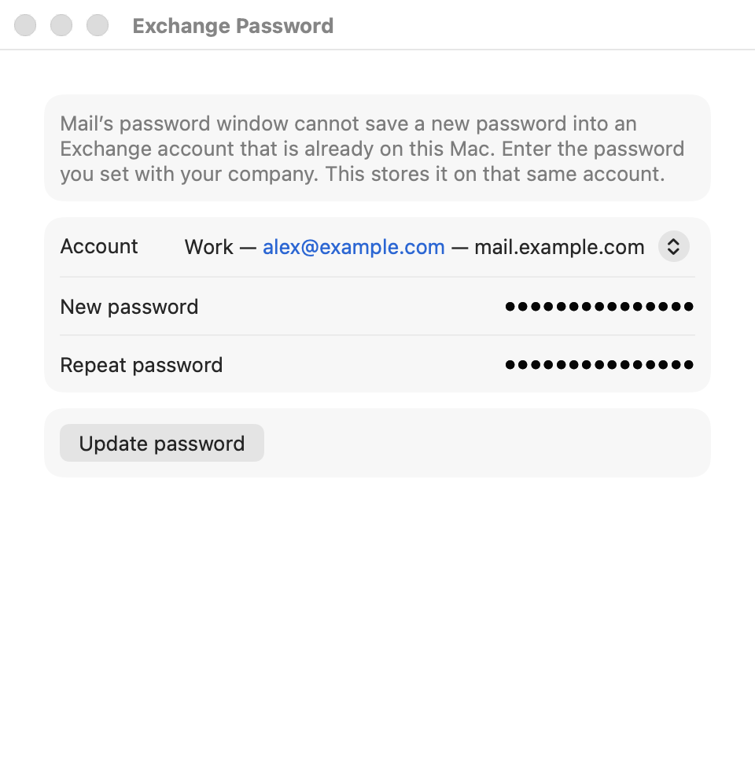

# Exchange Password

Sets a new password on the Exchange account Mail already has.

Mail’s password dialog checks the password, then tries to create another account with the same user name. macOS rejects that with “This account already exists,” and the new password is never saved. This app sets the password on the existing account, then tells Mail to reconnect. A successful connection saves the password. If Mail asks for the password again, the new password was not saved.

The app does not change your company password, and it does not delete or recreate the account. macOS stores the new password in the keychain for that account.



Copyright © 2026 Peter Adrianov. Licensed under the MIT License.

## Use

```sh
./build.sh
open "build/Exchange Password.app"
```

On the first run, allow the app to control Mail and System Events (System Settings → Privacy & Security → Automation). If Mail is showing the stuck password dialog, the app clicks Cancel, then sets the password on the existing account.

Enter the password you already changed at your company. Closing the window quits the app.

## Layout

- `Sources/ExchangePasswordApp.swift` — window for the account and password
- `Sources/ExchangeAccount.swift` — Exchange accounts from Mail
- `Sources/MailPassword.swift` — close the stuck dialog and set the password through Mail
- `Info.plist` — name and bundle id
- `build.sh` — build `build/Exchange Password.app`
- `screenshot.png` — window picture with a sample account
